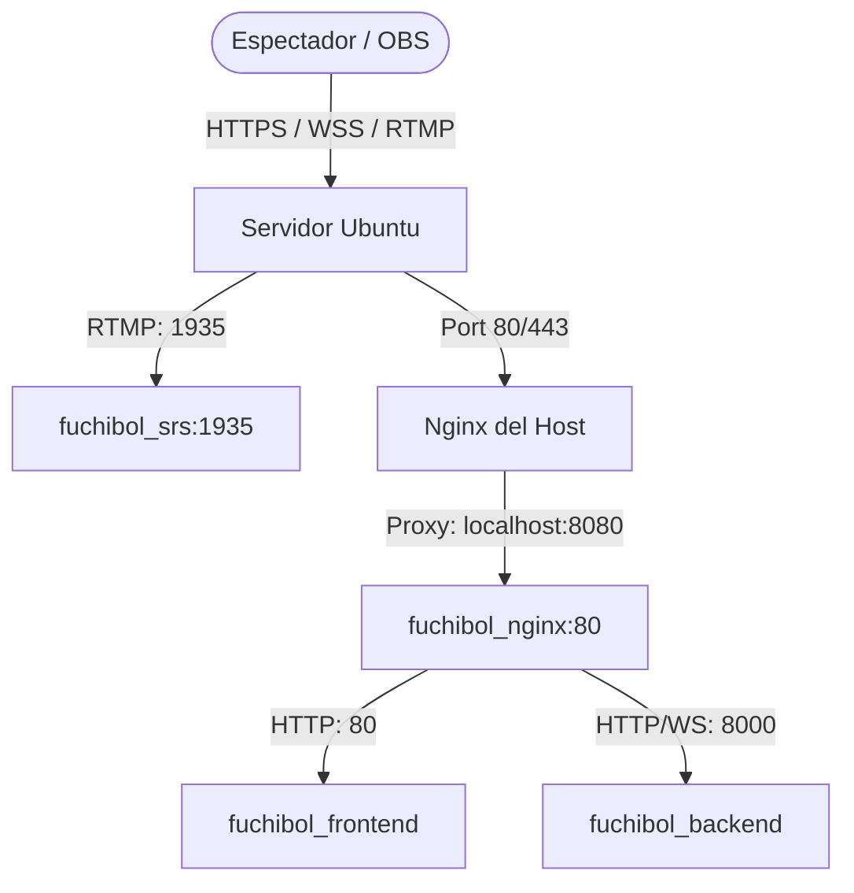

# Plan de Despliegue — Fuchibol

Este documento detalla el plan de despliegue para la plataforma **Fuchibol** en un servidor Ubuntu, donde todo el tráfico web y WebSocket es servido a través del dominio **`fuchibol.elconsejosupremo.com`** gestionado por un Nginx a nivel del sistema operativo (host) que actúa como proxy inverso hacia los contenedores de Docker.

---

## Arquitectura de Red y Despliegue



---

## Paso 1: Modificaciones en la configuración de Docker

Para evitar conflictos de puertos en el host (ya que el Nginx del host ocupará los puertos `80` y `443`), modificamos la exposición de puertos del contenedor `fuchibol_nginx` para que escuche en un puerto interno del host (por ejemplo, el `8080`), limitando el acceso únicamente a conexiones locales (`127.0.0.1`).

> [!TIP]
> **Resolución de conflictos de puertos**: Si los puertos sugeridos en el host (`8080` para Nginx o `1935` para SRS) ya están siendo ocupados por otros servicios en ejecución en tu servidor Ubuntu, **no detengas ni mates esos procesos**. En su lugar, toma cualquier otro puerto interno libre en el host modificando la sección izquierda en el mapeo de puertos de Docker (por ejemplo, `127.0.0.1:8085:80` para Nginx o `1936:1935` para SRS). Luego, recuerda actualizar el puerto en la configuración del Nginx del host (`proxy_pass http://127.0.0.1:8085;`) o en tu software OBS (`rtmp://[IP_PUBLICA_DEL_SERVIDOR]:1936/live`), respectivamente.

### 1. Actualizar [**`docker-compose.yml`**](file:///C:/Users/GATA/Desktop/fuchibol/docker-compose.yml)

Aplica los siguientes cambios en tu archivo compose en el servidor:

```yaml
  # ... en el servicio backend ...
  backend:
    # ...
    environment:
      - DATABASE_URL=postgresql://fuchibol_user:fuchibol_password@db:5432/fuchibol_db
      - REDIS_URL=redis://redis:6379/0
      - SECRET_KEY=CAMBIA_ESTA_CLAVE_POR_UNA_FUERTE_EN_PRODUCCION
      - JWT_ALGORITHM=HS256
      - HLS_BASE_URL=https://fuchibol.elconsejosupremo.com/hls # <-- URL de reproducción con HTTPS
  
  # ... en el servicio nginx ...
  nginx:
    container_name: fuchibol_nginx
    build:
      context: ./nginx
    restart: always
    ports:
      - "127.0.0.1:8080:80" # <-- Mapeado de forma segura a localhost:8080 en el host
    volumes:
      - srs_hls:/usr/share/nginx/html/hls
    depends_on:
      - backend
      - frontend
```

---

## Paso 2: Configuración de Nginx en el Host (Ubuntu)

1. Instala Nginx en el host:
   ```bash
   sudo apt update
   sudo apt install nginx -y
   ```

2. Crea el archivo de configuración para el sitio en `/etc/nginx/sites-available/fuchibol.elconsejosupremo.com`:
   ```bash
   sudo nano /etc/nginx/sites-available/fuchibol.elconsejosupremo.com
   ```

3. Agrega la siguiente configuración:
   ```nginx
   server {
       listen 80;
       server_name fuchibol.elconsejosupremo.com;

       # Configuración para proxy inverso hacia el contenedor Nginx de Docker
       location / {
           proxy_pass http://127.0.0.1:8080;
           proxy_http_version 1.1;
           
           # Soporte para WebSockets (Chat Socket.IO)
           proxy_set_header Upgrade $http_upgrade;
           proxy_set_header Connection "upgrade";
           
           # Cabeceras de cliente reales
           proxy_set_header Host $host;
           proxy_set_header X-Real-IP $remote_addr;
           proxy_set_header X-Forwarded-For $proxy_add_x_forwarded_for;
           proxy_set_header X-Forwarded-Proto $scheme;
           
           # Ajustar tamaño máximo de subida si es necesario
           client_max_body_size 50M;
       }
   }
   ```

4. Habilita el sitio creando un enlace simbólico y recarga Nginx:
   ```bash
   sudo ln -s /etc/nginx/sites-available/fuchibol.elconsejosupremo.com /etc/nginx/sites-enabled/
   sudo nginx -t
   sudo systemctl reload nginx
   ```

---

## Paso 3: Configurar SSL (HTTPS) con Let's Encrypt

Para habilitar conexiones seguras HTTPS (necesarias para producción y reproducción HLS en navegadores modernos):

1. Instala Certbot y el plugin de Nginx:
   ```bash
   sudo apt install certbot python3-certbot-nginx -y
   ```

2. Genera y configura automáticamente el certificado SSL para tu dominio:
   ```bash
   sudo certbot --nginx -d fuchibol.elconsejosupremo.com
   ```
   *Sigue las instrucciones en pantalla. Selecciona la opción de **redireccionar automáticamente todo el tráfico HTTP a HTTPS**.*

---

## Paso 4: Ajustar Firewall (UFW)

Asegúrate de permitir el tráfico en los puertos públicos necesarios para la web (Nginx) y la ingesta de video (SRS):

```bash
# Permitir Nginx HTTP/HTTPS en el host
sudo ufw allow 'Nginx Full'

# Permitir ingesta RTMP de OBS
sudo ufw allow 1935/tcp

# Habilitar el firewall (si no estaba habilitado)
sudo ufw enable
```

---

## Paso 5: Despliegue de los contenedores

Una vez configurado el host, inicia los contenedores e inicializa la base de datos:

```bash
# Iniciar servicios con Docker Compose en segundo plano
docker compose up --build -d

# Ejecutar las migraciones pendientes en PostgreSQL
docker compose exec backend alembic upgrade head
```

---

## Validación

* **Web y Chat**: Entra en `https://fuchibol.elconsejosupremo.com` en tu navegador. Debería cargar la interfaz del frontend y permitirte registrarte/loguearte conectándose correctamente por WebSockets.
* **Transmisión (OBS)**: En OBS emite a `rtmp://[IP_PUBLICA_DEL_SERVIDOR]/live` utilizando la stream key correspondiente.
